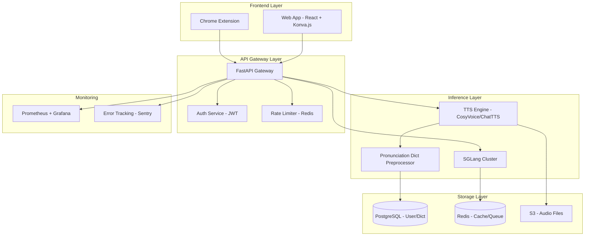

# aimake.cc MVP Development Roadmap

## 🎯 MVP Vision

**打造首个"发音精确的多模态创作中台"**，聚焦于 TTS + 发音词典 + 无限画布交互，3 个月内上线可商业化的产品。

---

## 📋 MVP Scope Definition

### ✅ 核心功能（Must-Have）

#### 1. TTS Engine with Pronunciation Dictionary
- **实时语音合成**：支持中英文，延迟 < 500ms
- **发音词典管理**：
  - 用户上传自定义词典（CSV/JSON 格式）
  - 在线编辑单词发音（IPA 音标或拼音）
  - 实时预览修正效果
- **多音字智能识别**：基于上下文自动选择正确读音
- **语音导出**：支持 MP3/WAV 格式

#### 2. Infinity Canvas (无限画布)
- **卡片式创作流**：
  - Prompt 卡片 + 结果预览卡片
  - 支持拖拽、缩放、复制
  - 版本对比（A/B 测试）
- **流式生成**：边输入边预览
- **资源管理**：音频波形可视化、历史记录

#### 3. Chrome Extension
- **一键提取**：网页文本 → aimake.cc
- **快捷操作**：选中文本右键菜单 "Make Audio"
- **同步账号**：自动保存到用户画布

#### 4. User System
- **认证**：邮箱注册 + Google OAuth
- **配额管理**：免费版 10 小时/月，付费版无限
- **API Key**：为开发者提供 REST API

### ⚠️ 暂不包含（Phase 2）
- 视频生成（Avatar/视频配音）
- 低代码工作流编排
- 多租户私有部署
- 移动端 App

---

## 🏗️ Technical Architecture

### System Architecture Diagram



### Tech Stack Details

| Layer | Technology | Reason |
|-------|-----------|--------|
| **Frontend** | React 18 + TypeScript | 生态成熟，Canvas 库支持好 |
| **Canvas Rendering** | Konva.js + react-konva | 高性能 2D 渲染，支持拖拽 |
| **State Management** | Zustand | 轻量级，比 Redux 简单 |
| **UI Components** | Shadcn/ui + TailwindCSS | 现代设计，快速开发 |
| **Backend** | FastAPI (Python 3.11+) | 异步高性能，与 SGLang 集成方便 |
| **Inference** | SGLang 0.3+ | 比 vLLM 快 29%，支持多轮缓存 |
| **TTS** | CosyVoice / ChatTTS | 开源可控，支持中英文 |
| **Database** | PostgreSQL 16 | 强事务，JSONB 支持词典存储 |
| **Cache/Queue** | Redis 7 + Bull MQ | 高性能缓存 + 任务队列 |
| **Object Storage** | MinIO (开发) / AWS S3 (生产) | 成本优化 |
| **Container** | Docker + Docker Compose | 本地开发一致性 |
| **Orchestration** | Kubernetes (k3s 开发) | 自动扩缩容 |
| **Monitoring** | Prometheus + Grafana | 开源可控 |

---

## 📅 12-Week Development Timeline

### **Phase 1: Foundation (Week 1-3)**

#### Week 1: Environment Setup & API Design

**Backend Team**
- [ ] 搭建开发环境（Docker Compose）
  - PostgreSQL + Redis + MinIO
  - FastAPI 项目脚手架
- [ ] 设计 API 接口规范（OpenAPI 3.0）
  - `/api/v1/tts/synthesize` - 语音合成
  - `/api/v1/dict/entries` - 词典管理
  - `/api/v1/canvas/save` - 画布保存
- [ ] 实现用户认证系统
  - JWT Token 签发/验证
  - Google OAuth 2.0 集成
- [ ] Database Schema 设计
  ```sql
  -- users table
  CREATE TABLE users (
    id UUID PRIMARY KEY,
    email VARCHAR(255) UNIQUE,
    oauth_provider VARCHAR(50),
    quota_hours INT DEFAULT 10,
    created_at TIMESTAMP
  );

  -- pronunciation_dicts table
  CREATE TABLE pronunciation_dicts (
    id UUID PRIMARY KEY,
    user_id UUID REFERENCES users(id),
    word VARCHAR(100),
    pronunciation VARCHAR(200),
    language VARCHAR(10),
    context TEXT,
    created_at TIMESTAMP
  );

  -- audio_assets table
  CREATE TABLE audio_assets (
    id UUID PRIMARY KEY,
    user_id UUID REFERENCES users(id),
    text TEXT,
    audio_url VARCHAR(500),
    duration FLOAT,
    created_at TIMESTAMP
  );
  ```

**Frontend Team**
- [ ] 初始化 React 项目（Vite + TypeScript）
- [ ] 配置 TailwindCSS + Shadcn/ui
- [ ] 实现登录/注册页面
- [ ] 设计 UI 组件库
  - Button, Input, Card, Modal
  - AudioPlayer 组件

**Infrastructure Team**
- [ ] 配置 GitHub Actions CI/CD
- [ ] 申请 L40/L20 服务器访问权限
- [ ] 安装 SGLang + TTS 模型
  - 测试 Llama 3.2 推理性能
  - 部署 CosyVoice TTS

**Deliverable**
- ✅ 可运行的后端 API（Swagger 文档）
- ✅ 前端登录流程可用
- ✅ TTS 服务基础调用成功

---

#### Week 2: Core TTS Implementation

**Backend Team**
- [ ] 实现 TTS 合成 API
  - 集成 CosyVoice Python SDK
  - 支持 SSML 标签（语速、音调）
  - 流式音频返回（WebSocket）
- [ ] 发音词典预处理器
  ```python
  class PronunciationProcessor:
      def __init__(self, user_dict_path):
          self.user_dict = self.load_dict(user_dict_path)
          self.pinyin_engine = pypinyin  # 中文
          self.g2p_en = g2p_en.G2p()      # 英文

      def preprocess_text(self, text: str) -> str:
          # 1. 替换用户自定义词汇
          for word, pronunciation in self.user_dict.items():
              text = text.replace(word, f"<phoneme ph='{pronunciation}'>{word}</phoneme>")
          # 2. 处理多音字（基于上下文）
          # 3. 返回 SSML 格式文本
          return ssml_text
  ```
- [ ] 音频文件存储与管理
  - 上传到 S3/MinIO
  - 返回预签名 URL（24 小时有效）

**Frontend Team**
- [ ] 实现 TTS 编辑器页面
  - 文本输入框（支持 Markdown）
  - 实时字数统计
  - "Generate Audio" 按钮
- [ ] 音频播放器组件
  - 波形可视化（WaveSurfer.js）
  - 播放/暂停/下载

**Deliverable**
- ✅ 用户可输入文本生成语音
- ✅ 音频可在线播放和下载

---

#### Week 3: Pronunciation Dictionary MVP

**Backend Team**
- [ ] 词典 CRUD API
  - `POST /api/v1/dict/entries` - 添加词条
  - `GET /api/v1/dict/entries?word={word}` - 查询
  - `PUT /api/v1/dict/entries/{id}` - 更新
  - `DELETE /api/v1/dict/entries/{id}` - 删除
- [ ] 批量导入功能
  - 支持 CSV 格式：`word,pronunciation,language`
  - 异步任务队列（Bull MQ）处理大文件

**Frontend Team**
- [ ] 词典管理界面
  - 表格展示（支持搜索/过滤）
  - 在线编辑（Modal 弹窗）
  - 导入/导出按钮
- [ ] 实时预览功能
  - 修改词条后立即生成测试音频
  - 对比修正前后的发音

**Testing**
- [ ] 编写 E2E 测试（Playwright）
  - 用户注册 → 上传词典 → 生成语音
- [ ] 性能测试
  - 100 并发 TTS 请求
  - 目标：P95 延迟 < 1s

**Deliverable**
- ✅ 词典功能完整可用
- ✅ 通过 E2E 测试

---

### **Phase 2: Infinity Canvas (Week 4-6)**

#### Week 4: Canvas Core Implementation

**Frontend Team**
- [ ] 基于 Konva.js 实现无限画布
  ```tsx
  // Canvas 核心组件
  const InfinityCanvas = () => {
    const [cards, setCards] = useState<Card[]>([]);
    const [scale, setScale] = useState(1);
    const [position, setPosition] = useState({ x: 0, y: 0 });

    return (
      <Stage width={window.innerWidth} height={window.innerHeight}>
        <Layer>
          {cards.map(card => (
            <PromptCard
              key={card.id}
              {...card}
              draggable
              onDragEnd={handleCardMove}
            />
          ))}
        </Layer>
      </Stage>
    );
  };
  ```
- [ ] 卡片类型设计
  - **PromptCard**：用户输入的文本
  - **AudioCard**：生成的音频 + 波形
  - **CompareCard**：A/B 对比（两个音频）

**Backend Team**
- [ ] 画布状态存储 API
  - `POST /api/v1/canvas/save` - 保存画布
  - `GET /api/v1/canvas/{id}` - 加载画布
  - 使用 PostgreSQL JSONB 字段存储卡片数据

**Deliverable**
- ✅ 用户可拖拽卡片
- ✅ 画布状态可保存/加载

---

#### Week 5: Streaming & Real-time Features

**Backend Team**
- [ ] WebSocket 实现流式 TTS
  ```python
  @app.websocket("/ws/tts/stream")
  async def tts_stream(websocket: WebSocket):
      await websocket.accept()
      text = await websocket.receive_text()

      async for audio_chunk in tts_engine.synthesize_stream(text):
          await websocket.send_bytes(audio_chunk)
  ```
- [ ] Redis Pub/Sub 用于多端同步
  - 用户在 Chrome 插件创建内容 → 实时显示在 Web 端画布

**Frontend Team**
- [ ] 实现流式音频播放
  - 使用 MediaSource API 边接收边播放
- [ ] 版本历史功能
  - 每次生成音频自动保存历史版本
  - 可回滚到任意版本

**Deliverable**
- ✅ 流式 TTS 延迟 < 500ms
- ✅ 多端实时同步

---

#### Week 6: Canvas UX Optimization

**Frontend Team**
- [ ] 快捷键支持
  - `Cmd + Enter` - 生成音频
  - `Cmd + D` - 复制卡片
  - `Del` - 删除卡片
- [ ] 撤销/重做（Undo/Redo）
  - 使用 Immer.js 实现不可变状态
- [ ] 模板系统
  - 预设模板：播客脚本、教学课件、广告配音

**Design Team**
- [ ] 优化交互动画（Framer Motion）
- [ ] 暗色模式支持

**Testing**
- [ ] 用户体验测试（5-10 个 beta 用户）
- [ ] 收集反馈并快速迭代

**Deliverable**
- ✅ 画布 UX 流畅，无明显卡顿
- ✅ 用户满意度 > 4/5

---

### **Phase 3: Chrome Extension (Week 7-8)**

#### Week 7: Extension Core Development

**Frontend Team**
- [ ] Chrome Extension 项目初始化（Manifest V3）
  ```json
  {
    "manifest_version": 3,
    "name": "aimake.cc - AI Audio Maker",
    "version": "0.1.0",
    "permissions": ["contextMenus", "storage", "activeTab"],
    "background": {
      "service_worker": "background.js"
    },
    "content_scripts": [{
      "matches": ["<all_urls>"],
      "js": ["content.js"]
    }]
  }
  ```
- [ ] 功能实现
  - 右键菜单 "Make Audio" → 发送选中文本到 aimake.cc
  - Popup 界面显示最近生成的音频
  - 与 Web 端账号同步（LocalStorage + JWT）

**Backend Team**
- [ ] CORS 配置允许 Extension 请求
- [ ] Extension API 限流（防止滥用）

**Deliverable**
- ✅ Extension 可提交 Chrome Web Store 审核

---

#### Week 8: Extension Polish & Testing

**Frontend Team**
- [ ] 支持批量提取
  - 用户选中多段文本 → 自动分段生成
- [ ] 错误处理与重试逻辑
- [ ] Extension 设置页面
  - 选择默认语音
  - 配置快捷键

**Testing**
- [ ] 测试主流网站兼容性
  - Medium, Wikipedia, Twitter, Reddit
- [ ] 性能测试（避免阻塞页面渲染）

**Deliverable**
- ✅ Extension 通过 Chrome Web Store 审核
- ✅ 发布 Beta 版本

---

### **Phase 4: Polish & Launch Prep (Week 9-12)**

#### Week 9: Performance Optimization

**Backend Team**
- [ ] SGLang 推理优化
  - 启用 RadixAttention（缓存多轮对话）
  - Batch 合并请求（提升吞吐量）
- [ ] 数据库查询优化
  - 添加索引：`CREATE INDEX idx_user_dict ON pronunciation_dicts(user_id, word);`
  - 使用 Connection Pool

**Frontend Team**
- [ ] 代码分割（React.lazy + Suspense）
- [ ] 图片/音频懒加载
- [ ] Service Worker 缓存静态资源

**Deliverable**
- ✅ Lighthouse 得分 > 90
- ✅ TTS 延迟 P95 < 800ms

---

#### Week 10: Security & Compliance

**Backend Team**
- [ ] 安全加固
  - API Rate Limiting（100 req/min per user）
  - SQL Injection 防护（使用 ORM）
  - XSS 防护（Content-Security-Policy）
- [ ] 数据备份策略
  - PostgreSQL 每日自动备份
  - S3 音频文件设置生命周期（90 天后删除）

**Legal/Compliance**
- [ ] 编写隐私政策与服务条款
- [ ] GDPR 合规检查
  - 用户可导出/删除所有数据

**Deliverable**
- ✅ 通过安全审计（OWASP Top 10）
- ✅ 法律文档完成

---

#### Week 11: Beta Testing & Bug Fixes

**QA Team**
- [ ] 招募 50 个 Beta 测试用户
  - 来源：Product Hunt, Twitter, Reddit
- [ ] 建立反馈渠道
  - Discord 社区 + Google Forms

**Dev Team**
- [ ] 每日修复 P0/P1 Bug
- [ ] 监控系统稳定性（Sentry 报警）

**Deliverable**
- ✅ 主要 Bug 修复率 > 95%
- ✅ 系统可用性 > 99.5%

---

#### Week 12: Launch!

**Marketing Team**
- [ ] 制作 Demo 视频（2 分钟）
  - 展示 TTS + 词典 + 画布的完整流程
- [ ] 准备 Product Hunt 发布
  - 标题：*"aimake.cc - The fastest AI audio maker with pronunciation control"*
  - 邀请 100+ upvotes

**Dev Team**
- [ ] 灰度发布（10% 流量 → 50% → 100%）
- [ ] 实时监控流量与错误

**Community**
- [ ] 在 Twitter/X 发布上线消息
- [ ] 邀请技术博主试用（如 Hugging Face 社区）

**Deliverable**
- ✅ 正式上线 v1.0.0
- ✅ Product Hunt 排名 Top 5

---

## 💰 Resource Requirements

### Team Composition (Recommended)

| Role | Headcount | Responsibility |
|------|-----------|----------------|
| **Full-Stack Engineer** | 2 | 后端 API + 前端 Canvas |
| **Frontend Engineer** | 1 | UI/UX + Chrome Extension |
| **ML Engineer** | 1 | SGLang/TTS 优化 |
| **DevOps** | 0.5 (Part-time) | Kubernetes + 监控 |
| **Product Manager** | 0.5 (Part-time) | 需求管理 + Beta 测试 |

**Total: 5 FTE**

### Infrastructure Cost (Monthly)

| Item | Spec | Cost |
|------|------|------|
| **GPU Server** | 2x L40 (48GB) | $2,000/月 (云厂商) |
| **CPU Server** | 8 vCPU, 32GB RAM | $200/月 |
| **Database** | PostgreSQL (RDS) | $100/月 |
| **Storage** | 1TB S3 | $25/月 |
| **Bandwidth** | 10TB/月 | $100/月 |
| **Monitoring** | Grafana Cloud | $50/月 |
| **CDN** | Cloudflare | $20/月 |

**Total: ~$2,500/月**

💡 **成本优化建议**：
- 使用 Spot 实例降低 GPU 成本 60%
- 自建 MinIO 替代 S3（初期）

---

## 📊 Success Metrics

### Launch (End of Week 12)
- ✅ **100 付费用户**（$49/月 Starter Plan）
- ✅ **1,000 注册用户**
- ✅ **Chrome Extension 安装数 > 500**

### Post-Launch (Month 2-3)
- **MRR (月经常性收入) > $5,000**
- **用户留存率 > 40%**（30 天）
- **NPS (Net Promoter Score) > 50**

### Technical KPIs
- **系统可用性 > 99.9%**
- **TTS 延迟 P95 < 800ms**
- **API 错误率 < 0.1%**

---

## ⚠️ Risk Management

| Risk | Probability | Impact | Mitigation |
|------|-------------|--------|------------|
| **GPU 资源不足** | Medium | High | 提前联系云厂商保留实例 |
| **TTS 模型版权问题** | Low | High | 使用开源模型（CosyVoice/ChatTTS） |
| **Chrome Extension 被拒** | Medium | Medium | 严格遵守 Privacy Policy |
| **用户获取成本过高** | High | Medium | 专注有机增长（SEO + 社区） |
| **竞品降价** | Medium | High | 强调 "自主部署 + 词典" 差异化 |

---

## 🎯 Post-MVP Roadmap (Phase 2, Month 4-6)

### Planned Features
1. **视频配音**（LipSync + Avatar）
2. **多语言支持**（日语、韩语、西班牙语）
3. **API Marketplace**（允许第三方集成）
4. **私有部署版本**（Enterprise $999/月）
5. **移动端 App**（React Native）

---

## 📞 Next Steps

### This Week
- [ ] 技术团队 Kick-off Meeting
- [ ] 确定 L40/L20 服务器配置
- [ ] 设计 Database Schema

### This Month
- [ ] 完成 Week 1-4 核心开发
- [ ] 招募 Beta 测试用户
- [ ] 注册 aimake.cc 商标

---

**Let's build something amazing! 🚀**

---

## Appendix

### A. API Endpoint List

```
# Authentication
POST /api/v1/auth/register
POST /api/v1/auth/login
POST /api/v1/auth/google
GET  /api/v1/auth/me

# TTS
POST /api/v1/tts/synthesize
WS   /ws/tts/stream

# Pronunciation Dictionary
GET    /api/v1/dict/entries
POST   /api/v1/dict/entries
PUT    /api/v1/dict/entries/{id}
DELETE /api/v1/dict/entries/{id}
POST   /api/v1/dict/import

# Canvas
GET  /api/v1/canvas/{id}
POST /api/v1/canvas/save

# Audio Assets
GET    /api/v1/audio/list
GET    /api/v1/audio/{id}
DELETE /api/v1/audio/{id}
```

### B. Database Schema (Full)

See `/docs/database-schema.sql` (to be created in Week 1)

### C. Monitoring Dashboard

Key metrics to track in Grafana:
- TTS request rate (req/s)
- TTS latency (P50, P95, P99)
- GPU utilization (%)
- Error rate by endpoint
- Active users (real-time)
