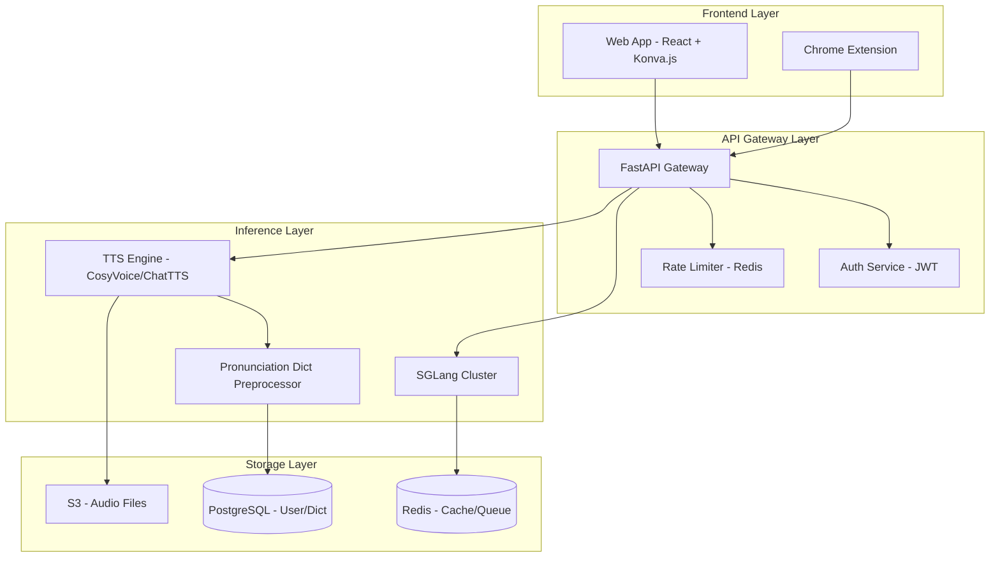

# aimake.cc - AI 多模态创作平台

> **AI + Make** - 打造首个"发音精确的多模态创作中台"

---

## 📚 快速导航

### 🚀 开始使用
- **[开发指南](./DEVELOPMENT.md)** - 快速开始开发
- **[项目结构](./PROJECT_STRUCTURE.md)** - 完整目录结构
- **[MVP 路线图](./MVP_ROADMAP.md)** - 12 周开发计划

### 核心文档

1. **[MVP 开发路线图](./MVP_ROADMAP.md)** ⭐
   - 12 周详细开发计划
   - 技术架构设计
   - 团队配置与资源需求
   - 成功指标与风险管理

2. **[技术栈对比分析](./docs/tech-stack-comparison.md)**
   - SGLang vs vLLM vs TensorRT-LLM
   - CosyVoice vs ChatTTS vs XTTS
   - React vs Vue vs Svelte
   - PostgreSQL vs MongoDB
   - 完整技术选型决策矩阵

3. **[数据库设计](./docs/database-schema.sql)**
   - 完整 PostgreSQL Schema
   - 用户、订阅、发音词典、画布等核心表
   - 索引优化与性能建议
   - 备份与恢复策略

4. **[成本分析与盈利模型](./docs/cost-analysis.md)**
   - 详细成本拆解（基础设施 + 人力）
   - 收入预测（保守/乐观场景）
   - Unit Economics（LTV、CAC、Churn）
   - 盈亏平衡分析

5. **[Landing Page 原型](./landing-page.html)** 🎨
   - 完整可交互的 HTML 原型
   - 基于 Tailwind CSS 的现代设计
   - 包含实时演示、动画效果
   - [设计文档](./docs/landing-page-design.md) | [实施指南](./docs/landing-page-guide.md)

6. **[Infinity Canvas 设计系统](./docs/design-package-readme.md)** 🎨
   - 完整 UI/UX 设计规范（避免 AI 紫色）
   - React + TypeScript 组件实现
   - Tailwind CSS 主题配置
   - 可访问性指南（WCAG 2.1 AA）
   - [设计系统](./docs/design-system.md) | [实施指南](./docs/implementation-guide.md) | [视觉参考](./docs/visual-reference.md)

7. **[AudioCard 组件](./docs/audiocard-usage.md)** 🎵 **NEW**
   - 完整音频播放组件（带波形可视化）
   - Canvas API 实时渲染
   - 键盘快捷键支持
   - [技术规范](./docs/audiocard-spec.md) | [组件代码](./frontend-components/canvas/AudioCard.tsx)

---

## 🎯 产品定位

### 核心理念

**"Infinity Canvas (无限画布)"** - 摒弃传统对话框模式，采用"创作画布"逻辑，让用户感觉是在"建造"内容，而不是在"聊天"。

### 三大差异化优势

1. **自主推理引擎**
   - 基于 SGLang（比 vLLM 快 29%）
   - 实时显示 TPS/延迟，强调 "Fast" 品牌
   - 支持 L40/L20 混合调度

2. **发音词典即服务**
   - 企业级 TTS 的杀手锏
   - 品牌名、产品术语、地名的精准发音
   - 可沉淀为品牌资产库

3. **无限画布交互**
   - 卡片化创作流程（类似 Figma/Miro）
   - 流式生成、版本对比、A/B 测试
   - 专为非技术用户设计

---

## 🏗️ 系统架构



---

## 📅 开发时间线

### Phase 1: Foundation (Week 1-3)
- [x] 环境搭建与 API 设计
- [x] 核心 TTS 实现
- [x] 发音词典 MVP

### Phase 2: Infinity Canvas (Week 4-6)
- [ ] Canvas 核心实现
- [ ] 流式音频与实时同步
- [ ] UX 优化

### Phase 3: Chrome Extension (Week 7-8)
- [ ] Extension 开发
- [ ] 多端同步

### Phase 4: Polish & Launch (Week 9-12)
- [ ] 性能优化
- [ ] 安全加固
- [ ] Beta 测试
- [ ] 正式上线

详见 [MVP_ROADMAP.md](./MVP_ROADMAP.md)

---

## 💰 商业模型

### 定价策略

| 计划 | 价格/月 | 核心功能 |
|------|---------|----------|
| **Free** | $0 | 10 小时 TTS/月 |
| **Starter** | $49 | 50 小时 + 自定义词典 |
| **Pro** | $199 | 无限 TTS + API 访问 |
| **Enterprise** | $999 | 私有部署 + LoRA 微调 |

### 收入预测

| 时间点 | MRR | ARR |
|--------|-----|-----|
| Month 3 | $2,465 | $29,580 |
| Month 6 | $15,318 | $183,816 |
| Month 12 | $44,495 | $533,940 |

**盈亏平衡**: Month 10（Bootstrap 模式）

详见 [cost-analysis.md](./docs/cost-analysis.md)

---

## 🛠️ 技术栈

### 后端
- **Language**: Python 3.11+
- **Framework**: FastAPI 0.104+
- **Inference**: SGLang 0.3+ (主) + vLLM (备选)
- **TTS**: CosyVoice (主) + ChatTTS (备选)
- **Database**: PostgreSQL 16
- **Cache**: Redis 7
- **Queue**: Bull MQ
- **Storage**: Cloudflare R2 (生产) / MinIO (开发)

### 前端
- **Framework**: React 18 + TypeScript
- **Canvas**: Konva.js + react-konva
- **State**: Zustand + Immer
- **UI**: Shadcn/ui + TailwindCSS
- **Build**: Vite 5

### 基础设施
- **Container**: Docker + Docker Compose
- **Orchestration**: Kubernetes (k3s)
- **CI/CD**: GitHub Actions
- **Monitoring**: Prometheus + Grafana + Sentry
- **CDN**: Cloudflare

详见 [tech-stack-comparison.md](./docs/tech-stack-comparison.md)

---

## 📊 竞品分析

### 主要竞品

| 类别 | 产品 | 优势 | 劣势 |
|------|------|------|------|
| **视频生成** | Google Veo, Sora 2, Runway | 视频质量高 | 价格贵，无发音定制 |
| **多模态平台** | WaveSpeed AI, Medeo AI | 一站式 | 界面复杂 |
| **TTS 企业** | ElevenLabs, Azure TTS | 语音克隆 | 独立服务，不集成 |
| **推理平台** | Together AI, Replicate | API 简单 | 黑盒，无法定制 |

### aimake.cc 的独特价值
- ✅ **自主推理引擎** = 成本与性能优势
- ✅ **发音词典** = 企业级 TTS 护城河
- ✅ **无限画布** = 差异化交互体验

---

## 🚀 快速开始

### 前置要求
- Node.js 18+
- Python 3.11+ (后端开发)
- Docker & Docker Compose (后端开发)
- GPU 服务器（生产环境推荐 L40/L20）

### 本地开发

```bash
# 克隆仓库
git clone https://github.com/yourusername/aimake.git
cd aimake

# 安装前端依赖
npm install

# 启动开发服务器
npm run dev

# 在浏览器访问
# http://localhost:3000
```

### 其他命令

```bash
# 类型检查
npm run type-check

# 构建生产版本
npm run build

# 预览生产构建
npm run preview
```

详细开发指南见 [CONTRIBUTING.md](./CONTRIBUTING.md)（待创建）

---

## 📈 成功指标

### Launch (Week 12)
- ✅ 100 付费用户
- ✅ 1,000 注册用户
- ✅ Chrome Extension 安装数 > 500

### Post-Launch (Month 2-3)
- MRR > $5,000
- 用户留存率 > 40% (30天)
- NPS > 50

### 技术 KPIs
- 系统可用性 > 99.9%
- TTS 延迟 P95 < 800ms
- API 错误率 < 0.1%

---

## 📞 联系方式

- **Email**: contact@aimake.cc
- **Twitter**: [@aimake_cc](https://twitter.com/aimake_cc)
- **Discord**: [加入社区](https://discord.gg/aimake)

---

## 📄 License

MIT License - 详见 [LICENSE](./LICENSE)

---

## 🙏 致谢

感谢以下开源项目：
- [SGLang](https://github.com/sgl-project/sglang)
- [CosyVoice](https://github.com/FunAudioLLM/CosyVoice)
- [Konva.js](https://konvajs.org/)
- [FastAPI](https://fastapi.tiangolo.com/)

---

**Built with ❤️ by the aimake.cc team**
