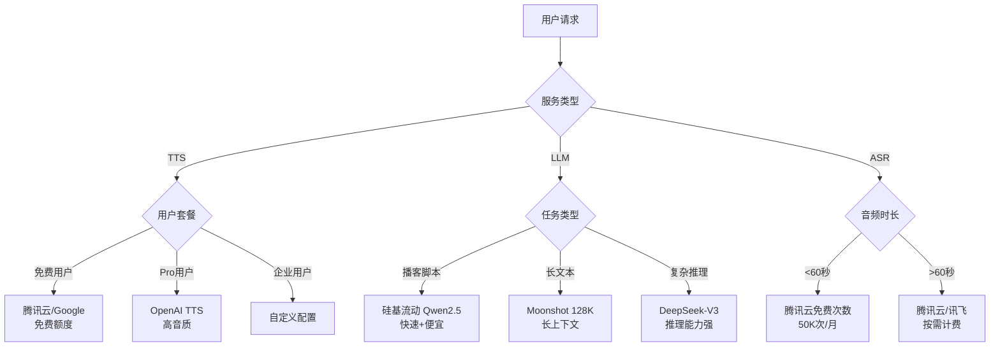

# AI 供应商选型总览

> 创建日期: 2026-01-09
> 目标: 为 AIMake 提供完整的 AI 服务供应商选型指南

---

## 📋 文档导航

本文档提供三大 AI 服务的供应商对比与选型建议：

| 服务类型 | 用途 | 详细文档 |
|---------|------|---------|
| **TTS** | 文本转语音 | [tts-free-providers.md](./tts-free-providers.md) - 快速接入<br>[tts-providers-comparison.md](./tts-providers-comparison.md) - 深度对比 |
| **LLM** | 大语言模型（播客脚本生成） | [llm-asr-providers.md](./llm-asr-providers.md) |
| **ASR** | 语音识别（音频转文字） | [llm-asr-providers.md](./llm-asr-providers.md) |

---

## 一、快速决策表

### MVP 阶段推荐配置（零成本上线）

| 服务 | 主力供应商 | 免费额度 | 备用供应商 | 月成本 |
|------|----------|---------|-----------|--------|
| **TTS** | 腾讯云 | 800万字符（3个月） | Google Cloud | **$0** |
| **LLM** | 硅基流动 | 2000万 tokens | 智谱 AI | **$0** |
| **ASR** | 腾讯云 | 10小时 + 50K次/月 | 讯飞 | **$0-35** |

**总计**: MVP 阶段（0-1000 用户）月成本 **$0-35**

---

## 二、TTS（文本转语音）

### 2.1 供应商对比

| 供应商 | 免费额度 | 付费价格 | 中文音质 | 推荐场景 |
|--------|---------|---------|---------|---------|
| **腾讯云** ⭐ | 800万字符（3个月） | ¥2/万字符 | ⭐⭐⭐⭐⭐ | MVP、中文为主 |
| **Google Cloud** | 400万字符/月（持续） | $4/百万字符 | ⭐⭐⭐⭐ | 多语言、持续运营 |
| **Amazon Polly** | 500万字符/月（持续） | $4/百万字符 | ⭐⭐⭐⭐ | 企业级、稳定性 |
| **Azure** | 500万字符/月（12个月） | $1/百万字符 | ⭐⭐⭐⭐ | 成本敏感 |
| **OpenAI TTS** | 无 | $15/百万字符 | ⭐⭐⭐⭐⭐ | 高音质需求 |
| **MiniMax** | 1万字符/月 | $30/百万字符 | ⭐⭐⭐⭐⭐ | 中文高质量 |
| **ElevenLabs** | 1万字符/月 | $300/百万字符 | ⭐⭐⭐⭐⭐ | 声音克隆 |

### 2.2 推荐配置

```yaml
MVP 阶段（0-100 用户）:
  primary: 腾讯云
    - 800万字符免费 = 666小时音频
    - 中文音质优秀
    - 完全覆盖 MVP 需求

  fallback: Google Cloud
    - 400万字符/月持续免费
    - 腾讯云用完或故障时切换

增长阶段（100-1000 用户）:
  free_tier: Google + Amazon + Azure
    - 联合使用三家免费额度
    - 共 1400万字符/月免费

  paid_fallback: Azure
    - 最便宜（$1/百万字符）
    - 免费额度用完后成本可控

规模化阶段（1000+ 用户）:
  intelligent_routing: 按用户套餐路由
    - 免费用户 → 免费供应商
    - Pro 用户 → OpenAI/MiniMax（高音质）
    - 企业用户 → 自定义配置
```

### 2.3 成本估算

```
1000 用户 × 10分钟/月 = 10,000分钟 = 200万字符

使用腾讯云（免费）: $0
使用 Google Cloud（免费）: $0
使用 Azure（付费）: 200万 × $0.001 = $2

结论: TTS 成本极低，MVP 阶段零成本
```

**详见**: [tts-free-providers.md](./tts-free-providers.md)

---

## 三、LLM（大语言模型）

### 3.1 供应商对比

| 供应商 | 免费额度 | 付费价格 | 推荐模型 | 适用场景 |
|--------|---------|---------|---------|---------|
| **硅基流动** ⭐ | 2000万 tokens | ¥0.70/百万 tokens | Qwen2.5-7B | 播客脚本生成 |
| **智谱 AI** | 1000万 tokens | ¥0.50/百万 tokens | GLM-4-flash | 备用 |
| **DeepSeek** | 500万 tokens | ¥1/百万 tokens（输入） | DeepSeek-V3 | 复杂推理 |
| **Moonshot** | 15元代金券 | ¥12/百万 tokens | moonshot-v1-128k | 长文本处理 |
| **阿里云百炼** | 100万 tokens | ¥8/百万 tokens | Qwen-turbo | 阿里云生态 |

### 3.2 推荐配置

```yaml
MVP 配置:
  primary: 硅基流动 - Qwen2.5-7B
    - 2000万 tokens 免费（最大）
    - 中文能力强
    - 可生成 4000 次播客脚本

  fallback: 智谱 AI - GLM-4-flash
    - 1000万 tokens 免费
    - 主力用完自动切换

  high_quality: DeepSeek-V3
    - 推理能力强
    - 复杂播客对话生成
    - 价格低（¥1/百万 tokens）

使用场景:
  - 播客脚本生成: 硅基流动 Qwen2.5-7B
  - 有声书提纲: Moonshot moonshot-v1-128k（长文本）
  - 复杂对话: DeepSeek-V3
```

### 3.3 成本估算

```
单次播客脚本生成:
  - 输入: 3000 tokens (原文 + Prompt)
  - 输出: 2000 tokens (对话脚本)
  - 总计: 5000 tokens

使用硅基流动:
  - 价格: ¥0.70/百万 tokens
  - 单次成本: ¥0.0035 ≈ $0.0005
  - 2000万免费额度 = 4000 次生成

1000 用户 × 2次生成/月 = 2000 次
使用免费额度: $0

结论: LLM 成本几乎为零，免费额度充足
```

**详见**: [llm-asr-providers.md](./llm-asr-providers.md#llm-供应商)

---

## 四、ASR（语音识别）

### 4.1 供应商对比

| 供应商 | 免费额度 | 付费价格 | 中文准确率 | 适用场景 |
|--------|---------|---------|-----------|---------|
| **腾讯云** ⭐ | 10小时 + 50K次/月 | ¥1.5/小时 | ⭐⭐⭐⭐⭐ | 播客编辑 |
| **讯飞** | 500万字符/年 | ¥2/小时 | ⭐⭐⭐⭐⭐ | 长期运营 |
| **火山引擎** | 100小时 | ¥2.5/小时 | ⭐⭐⭐⭐ | 高并发 |
| **阿里云** | 2小时/月（3个月） | ¥2.5/小时 | ⭐⭐⭐⭐ | 阿里云生态 |

### 4.2 推荐配置

```yaml
MVP 配置:
  primary: 腾讯云
    - 10小时新用户免费
    - 50K次/月持续免费（每次 ≤60秒）
    - 中文准确率高

  fallback: 讯飞
    - 500万字符/年免费（约 200小时）
    - 老牌厂商，稳定

使用场景:
  - 播客音频转文字编辑
  - 有声书校对（生成音频 → 文字对比原文）
  - 语音输入（用户语音输入需求）
```

### 4.3 成本估算

```
1000 用户 × 1小时/月 = 1000 小时

腾讯云免费:
  - 50K次/月 × 60秒 = 833小时免费
  - 超出 167小时 × ¥1.5 = ¥250.5 ≈ $35

讯飞免费:
  - 500万字符/年 = 约 200小时/年
  - 可作为长期备用

月成本: $0-35
```

**详见**: [llm-asr-providers.md](./llm-asr-providers.md#asr-供应商)

---

## 五、综合成本估算

### 5.1 MVP 阶段（0-1000 用户）

```
假设: 每用户/月
  - 生成 2次播客脚本（LLM）
  - 生成 10分钟音频（TTS）
  - 识别 1小时音频（ASR）

月度总成本:

LLM:
  - 1000用户 × 2次 = 2000次生成
  - 使用硅基流动: 完全免费（2000万额度够用）
  - 成本: $0

TTS:
  - 1000用户 × 10分钟 = 10,000分钟 = 200万字符
  - 使用腾讯云: 完全免费（800万字符够用）
  - 成本: $0

ASR:
  - 1000用户 × 1小时 = 1000小时
  - 腾讯云免费: 833小时
  - 超出: 167小时 × $0.21 = $35
  - 成本: $35

总成本: $0-35/月
```

### 5.2 增长阶段（1000-5000 用户）

```
假设: 每用户/月
  - 80% 免费用户（基础使用）
  - 20% Pro 用户（付费 $9.9/月）

月度成本:

LLM:
  - 免费用户: 4000次 × 5000 tokens = 2000万 tokens
    - 硅基流动免费: $0
  - Pro 用户: 1000次 × 10000 tokens = 1000万 tokens
    - DeepSeek-V3: 1000万 × $0.002 = $20

TTS:
  - 免费用户: 4000 × 10分钟 = 800万字符
    - Google + Amazon + Azure 免费额度: $0
  - Pro 用户: 1000 × 30分钟 = 600万字符
    - OpenAI TTS: 600万 × $0.015 = $90

ASR:
  - 免费用户: 4000 × 1小时 = 4000小时
    - 腾讯云 + 讯飞免费: 1033小时
    - 超出: 2967小时 × $0.21 = $623
  - Pro 用户: 1000 × 2小时 = 2000小时
    - 腾讯云: 2000小时 × $0.21 = $420

总成本: $1,153/月
总收入: 1000 × $9.9 = $9,900
利润率: 88.4%
```

---

## 六、供应商选型决策树



---

## 七、环境变量配置清单

### 7.1 TTS 配置

```bash
# .env

# 腾讯云 TTS
TENCENT_SECRET_ID=your-secret-id
TENCENT_SECRET_KEY=your-secret-key

# Google Cloud TTS
GOOGLE_APPLICATION_CREDENTIALS=/path/to/credentials.json

# Azure TTS
AZURE_SPEECH_KEY=your-subscription-key
AZURE_SPEECH_REGION=eastus

# OpenAI TTS（Pro 用户）
OPENAI_API_KEY=sk-xxx
```

### 7.2 LLM 配置

```bash
# 硅基流动
LLM_API_KEY=sk-xxx
LLM_BASE_URL=https://api.siliconflow.cn/v1
LLM_MODEL=Qwen/Qwen2.5-7B-Instruct

# 智谱 AI（备用）
LLM_FALLBACK_API_KEY=xxx.xxx
LLM_FALLBACK_BASE_URL=https://open.bigmodel.cn/api/paas/v4
LLM_FALLBACK_MODEL=glm-4-flash
```

### 7.3 ASR 配置

```bash
# 腾讯云 ASR
ASR_TENCENT_SECRET_ID=your-secret-id
ASR_TENCENT_SECRET_KEY=your-secret-key

# 讯飞 ASR（备用）
ASR_XUNFEI_APP_ID=your-app-id
ASR_XUNFEI_API_KEY=your-api-key
```

---

## 八、快速上线 Checklist

### Phase 1: 账号注册（1小时）

- [ ] 注册腾讯云账号（TTS + ASR）
- [ ] 注册硅基流动账号（LLM）
- [ ] 注册 Google Cloud 账号（TTS 备用）
- [ ] 注册智谱 AI 账号（LLM 备用）
- [ ] 注册讯飞账号（ASR 备用）

### Phase 2: API 密钥获取（30分钟）

- [ ] 腾讯云 SecretId + SecretKey
- [ ] 硅基流动 API Key
- [ ] Google Cloud Service Account JSON
- [ ] 智谱 AI API Key
- [ ] 讯飞 AppID + API Key

### Phase 3: 环境配置（30分钟）

- [ ] 创建 `.env` 文件
- [ ] 配置 TTS 环境变量
- [ ] 配置 LLM 环境变量
- [ ] 配置 ASR 环境变量
- [ ] 测试所有 API 连通性

### Phase 4: 代码集成（2小时）

- [ ] 实现 TTS 统一客户端（参考 tts-free-providers.md）
- [ ] 实现 LLM 统一客户端（参考 llm-asr-providers.md）
- [ ] 实现 ASR 统一客户端（参考 llm-asr-providers.md）
- [ ] 实现自动切换逻辑
- [ ] 编写单元测试

### Phase 5: 监控与告警（1小时）

- [ ] 配置使用量追踪
- [ ] 配置配额告警（剩余 <10% 时）
- [ ] 配置成本告警（超过预算时）
- [ ] 配置供应商故障告警

---

## 九、常见问题 FAQ

### Q1: 为什么选择腾讯云而不是 OpenAI TTS？

**A**:
- 腾讯云有 800万字符免费额度，OpenAI TTS 无免费额度
- MVP 阶段优先降低成本
- 腾讯云中文音质优秀（4.5/5分）
- Pro 用户可付费使用 OpenAI TTS 获取更高音质

### Q2: LLM 为什么不用 GPT-4？

**A**:
- GPT-4 价格是国产模型的 100 倍
- 国产模型（Qwen2.5、DeepSeek-V3）中文能力强
- 免费额度充足，MVP 阶段零成本
- 播客脚本生成不需要 GPT-4 级别的推理能力

### Q3: ASR 成本为什么相对较高？

**A**:
- ASR 处理的是长时音频（1小时）
- TTS/LLM 处理的是短文本（200字/2000字）
- 免费额度相对较小
- 建议优化：
  - 只在必要时使用 ASR（如播客编辑功能）
  - 基础 TTS 生成不需要 ASR

### Q4: 如何处理供应商故障？

**A**:
```python
# 自动切换逻辑
try:
    result = primary_provider.call()
except Exception:
    result = fallback_provider.call()
```

每个服务都配置了主备供应商，故障时自动切换。

### Q5: 免费额度用完怎么办？

**A**:
- TTS: 切换到 Google Cloud（400万字符/月持续免费）
- LLM: 切换到智谱 AI（1000万 tokens 免费）
- ASR: 切换到讯飞（500万字符/年免费）
- 最终兜底：使用最便宜的付费供应商

---

## 十、参考文档

### 官方文档

**TTS**:
- 腾讯云: https://cloud.tencent.com/document/product/1073
- Google Cloud: https://cloud.google.com/text-to-speech
- Azure: https://azure.microsoft.com/products/ai-services/text-to-speech

**LLM**:
- 硅基流动: https://siliconflow.cn/docs
- 智谱 AI: https://open.bigmodel.cn/dev/api
- DeepSeek: https://platform.deepseek.com/docs

**ASR**:
- 腾讯云: https://cloud.tencent.com/document/product/1093
- 讯飞: https://www.xfyun.cn/doc/asr/voicedictation/API.html

### 项目文档

- [TTS 供应商快速接入](./tts-free-providers.md)
- [TTS 供应商深度对比](./tts-providers-comparison.md)
- [LLM & ASR 供应商接入](./llm-asr-providers.md)

---

**最后更新**: 2026-01-09
**维护者**: AIMake 技术团队
